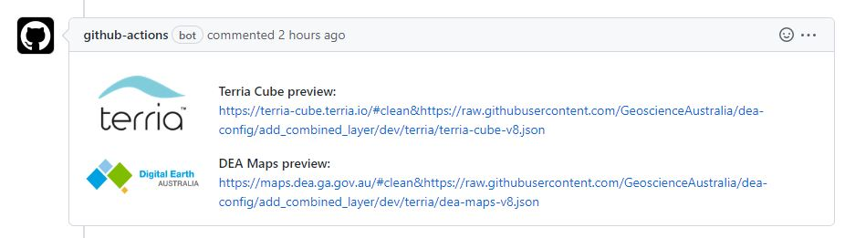

## Terria Cube TerriaJS config

This directory contains the `terria-cube-v8.json` TerriaJS config file for the development Terria Cube map (https://terria-cube.terria.io/).

The Terria Cube catalogue contains two sections: 

* **DEA Development** (for testing dev/non-prod OWS and Geoserver endpoints)
* **DEA Production** (for testing production OWS and Geoserver endpoints). 

Once changes have been tested on Terria Cube, they can be implemented in the DEA Maps catalogue by editing [the config here](https://github.com/GeoscienceAustralia/dea-config/blob/master/prod/terria/dea-maps-v8.json).

### Testing Terria config changes using the Terria preview bot

1. Make edits to the `terria-cube-v8.json`
2. Create a draft pull request
3. Once the pull request has been created, the Terria preview bot will post a comment containing links to a preview the draft config on Terria Cube:

4. Test the layer on the preview on Terria Cube, and update the pull request to fix any issues.
5. When ready, mark the pull request as "Ready for review".

### Testing Terria config changes manually

1. Download the `terria-cube-v8.json` file to your PC
2. Launch a clean instance of DEA Maps by appending `#clean` to the URL: https://terria-cube.terria.io/#clean
2. Drag the `terria-cube-v8.json` file from your PC into DEA Maps

### Catalog Json files standard

Use four spaces for indentation matching conventions used in Python and shell scripts.

#### Apply prettify using Visual Studio Code (VSCODE) IDE
1. Install Prettier - Code formatter extension
2. select the code changes in the file
3. Press `Ctrl + Shift + P` to open up a popup tool
4. Type in `Format Selection`