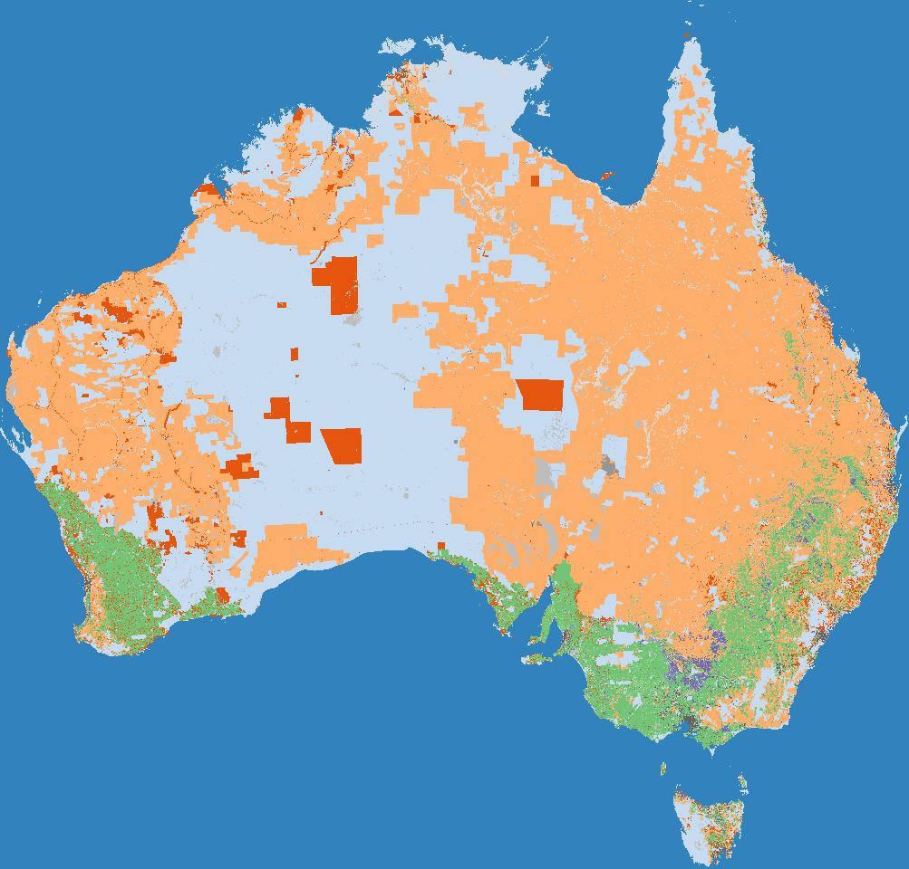

# ABARES Catchment scale land use of Australia - Update December 2020

## About the Data

This data product was produced and published by ABARES in 2020, with complete
information provided via:

> ABARES 2021, Catchment Scale Land Use of Australia – Update December 2020, Australian Bureau of Agricultural and Resource Economics and Sciences, Canberra, February, CC BY 4.0, DOI: 10.25814/aqjw-rq15




## Process

1. Download [`Catchment Scale Land Use of Australia – raster package (GeoTIFF and supporting files) – ZIP [126 MB]`](https://www.agriculture.gov.au/sites/default/files/documents/geotiff_clum_50m1220m.zip)
2. Convert to a Cloud Optimised GeoTIFF:

```
gdalwarp /gdata1/data/land_use/ABARES_CLUM/geotiff_clum_50m1220m/clum_50m1220m.tif clum_50m1220m.tiff -of COG -co NUM_THREADS=ALL_CPUS -co PREDICTOR=YES
```

4. Use [rio-stac](https://github.com/developmentseed/rio-stac) to generate STAC Item metadata:
```
rio stac https://dea-public-data-dev.s3-ap-southeast-2.amazonaws.com/abares_clum_2020/clum_50m1220m.tiff --densify-geom 10 | jq > abares_clum_2020.stac-item.json
```
2. Manually add some metadata to the STAC JSON, and manually create an ODC Product Definition YAML.

3. Generate thumbnail using `odc-geo`:

```
import matplotlib.pyplot as plt
import rioxarray
import odc.geo.xr

# Path to raster
path = "https://dea-public-data-dev.s3-ap-southeast-2.amazonaws.com/abares_clum_2020/clum_50m1220m.tiff"

# Load from file
ds = rioxarray.open_rasterio(
    path,
    masked=True,
    resampling="mode",
    chunks={"x": 4096, "y": 4096},
)

# Create reduced resolution geobox
new_geobox = ds.odc.geobox.zoom_out(80)

# Reproject array and load into memory with Dask
ds_reprojected = ds.odc.reproject(how=new_geobox)
ds_reprojected.load()

# Export to file
plt.imsave(
    "abares_clum_2020.thumbnail.jpg",
    ds_reprojected.squeeze("band").fillna(0),
    cmap="tab20c",
)
```
