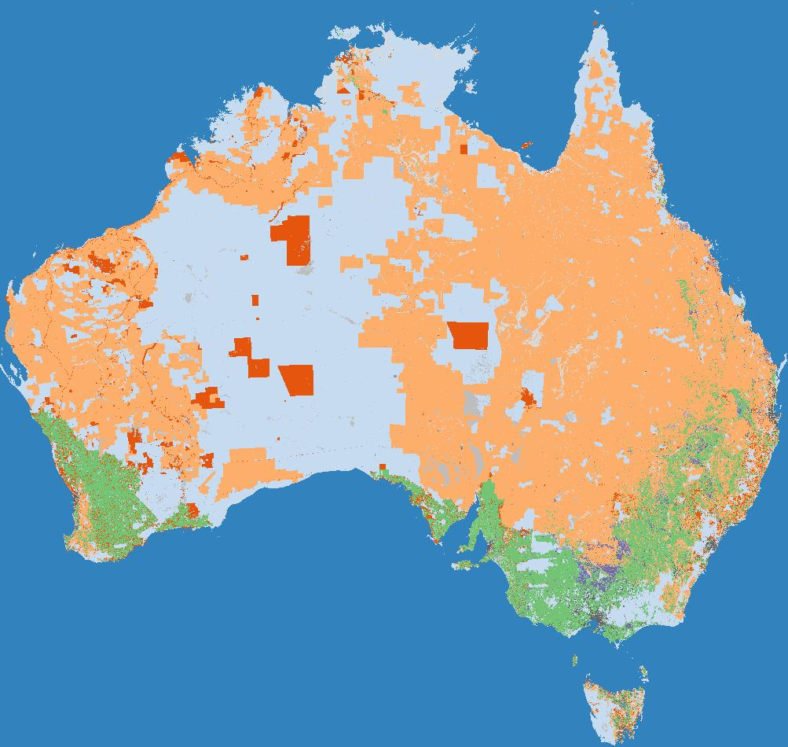

# ABARES Catchment scale land use of Australia - Update December 2023

## About the Data

This data product was produced and published by ABARES in 2023, with complete
information provided via:

> Land use: ABARES 2024, Catchment Scale Land Use of Australia – Update December 2023, Australian Bureau of Agricultural and Resource Economics and Sciences, Canberra, February, CC BY 4.0, DOI: 10.25814/2w2p-ph98




## Process

1. Download [`Catchment Scale Land Use of Australia – raster package (GeoTIFF and supporting files) – ZIP [152 MB]`](https://data.gov.au/data/dataset/8af26be3-da5d-4255-b554-f615e950e46d/resource/6deab695-3661-4135-abf7-19f25806cfd7/download/clum_50m_2023.zip)
2. Convert to a Cloud Optimised GeoTIFF:

```
gdalwarp /gdata1/data/land_use/ABARES_CLUM/geotiff_clum_50m1220m/clum_50m1220m.tif clum_50m1220m.tiff -of COG -co NUM_THREADS=ALL_CPUS -co PREDICTOR=YES
```

3. Use [rio-stac](https://github.com/developmentseed/rio-stac) to generate STAC Item metadata (`--densify-geom` ensures that EPSG:3577 geometry is correctly transformed to EPSG:4326 coords):

```
rio stac https://dea-public-data-dev.s3-ap-southeast-2.amazonaws.com/abares_clum_2023/clum_50m_2023.tiff --densify-geom 10 > abares_clum_2023.stac-item.json
```

4. Generate thumbnail using `odc-geo`:

```
import matplotlib.pyplot as plt
import rioxarray
import odc.geo.xr

# Path to raster
path = "https://dea-public-data-dev.s3-ap-southeast-2.amazonaws.com/abares_clum_2023/clum_50m_2023.tiff"

# Load from file
ds = rioxarray.open_rasterio(
    path,
    masked=True,
    resampling="mode",
    chunks={"x": 4096, "y": 4096},
)

# Create reduced resolution geobox
new_geobox = ds.odc.geobox.zoom_out(80)

# Reproject array and load into memory with Dask
ds_reprojected = ds.odc.reproject(how=new_geobox)
ds_reprojected.load()

# Export to file
plt.imsave(
    "abares_clum_2023.thumbnail.jpg",
    ds_reprojected.squeeze("band").fillna(0),
    cmap="tab20c",
)
```
5. Manually add some metadata to the STAC JSON (can compare against existing layers, e.g. [here](https://github.com/GeoscienceAustralia/dea-config/blob/master/products/others/ausbathytopo250m/ga_ausbathytopo250m_2023.stac-item.json)), and manually create an ODC Product Definition YAML (example [here](https://github.com/GeoscienceAustralia/dea-config/blob/master/products/others/ausbathytopo250m/ga_ausbathytopo250m_2023.odc-product.yaml)).

