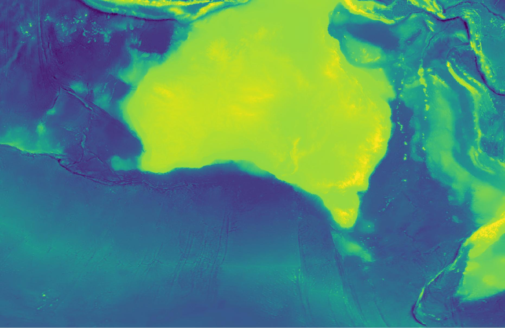

# Geoscience Australia AusBathyTopo 250m (Australia) 2023 Grid - A High-resolution Depth Model for Australia

## About the Data

This data product was produced and published by Geoscience Australia in 2023, with complete
information provided via:

> Beaman, R. AusBathyTopo 250m (Australia) 2023 Grid - A High-resolution Depth Model for Australia (20230004C). Geoscience Australia, Canberra. https://doi.org/10.26186/148758




## Process

1. Use [rio-stac](https://github.com/developmentseed/rio-stac) to generate STAC Item metadata:

    rio stac https://s3.ap-southeast-2.amazonaws.com/ausseabed-public-warehouse-bathymetry/L3/6009f454-290d-4c9a-a43d-00b254681696/Australian_Bathymetry_and_Topography_2023_250m_MSL_cog.tif | jq > ga_ausbathytopo250m_2023.stac-item.json

2. Manually add some metadata to the STAC JSON, and manually create an ODC Product Definition YAML.

3. Generate thumbnail using `odc-geo`:

```
import matplotlib.pyplot as plt
import rioxarray
import odc.geo.xr

# Path to raster
path = "https://s3.ap-southeast-2.amazonaws.com/ausseabed-public-warehouse-bathymetry/L3/6009f454-290d-4c9a-a43d-00b254681696/Australian_Bathymetry_and_Topography_2023_250m_MSL_cog.tif"

# Load from file
ds = rioxarray.open_rasterio(
    path,
    masked=True,
    chunks={"x": 2048, "y": 2048},
)

# Create reduced resolution geobox
new_geobox = ds.odc.geobox.zoom_out(10)

# Reproject array and load into memory with Dask
ds_reprojected = ds.odc.reproject(how=new_geobox)
ds_reprojected.load()

# Export to file
vmin, vmax = ds_reprojected.quantile([0.02, 0.98])
plt.imsave(
    "ga_ausbathytopo250m_2023.thumbnail.jpg",
    ds_reprojected.squeeze("band"),
    cmap="viridis",
    vmin=vmin,
    vmax=vmax,
) 
```
